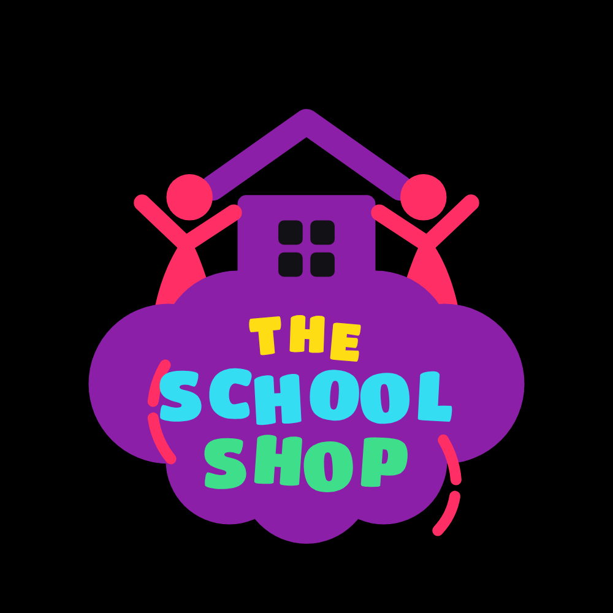
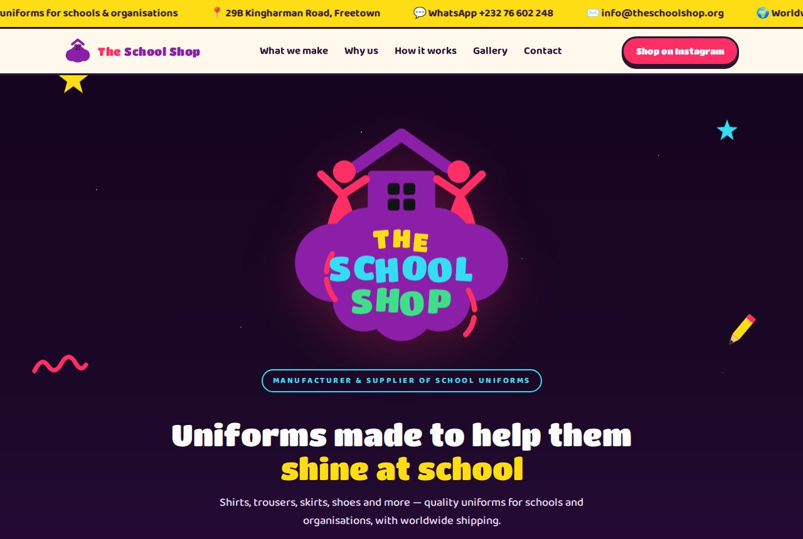
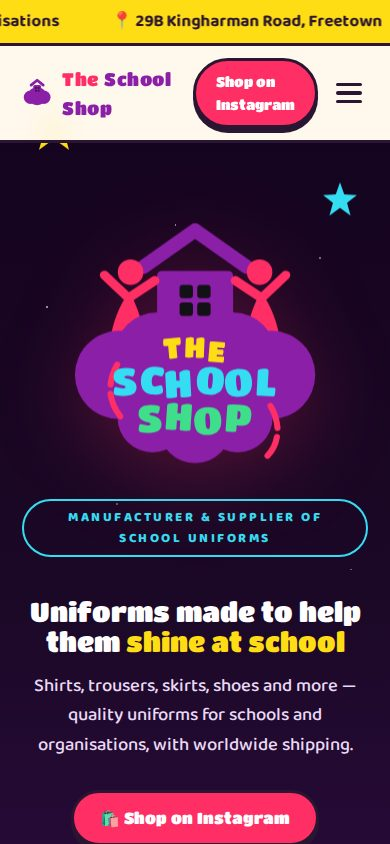
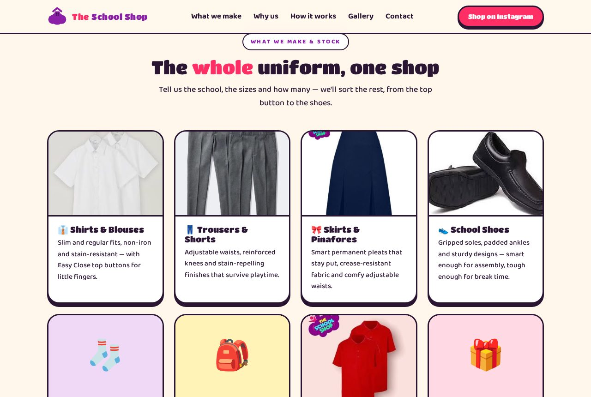

<div align="center">



# The School Shop

**Quality school uniforms, made properly — Freetown, Sierra Leone 🇸🇱**

Official website for The School Shop, manufacturer and supplier of quality uniforms
for schools and organisations, with worldwide shipping.


[**Instagram @the_school_shop_**](https://www.instagram.com/the_school_shop_/) ·
[**WhatsApp**](https://wa.me/23276602248) ·
[**info@theschoolshop.org**](mailto:info@theschoolshop.org)

</div>

---

## Overview

A fast, playful, single-page website built around The School Shop's brand identity.
The logo was recreated from scratch as a scalable SVG, the colour system is derived
from it, and every product photo comes from the shop's real Instagram feed.

There is **no framework, no build pipeline, and no external dependency at runtime** —
the deployed site is plain HTML, CSS and vanilla JavaScript with self-hosted fonts.
It works offline, loads fast on slow connections, and can be hosted on any static host.

## Preview

| Desktop | Mobile |
|:---:|:---:|
|  |  |

| Product categories | Photo gallery |
|:---:|:---:|
|  |  |

## Features

- 🎨 **Hand-built SVG logo** — vector recreation of the brand mark with the display
  font embedded, so it renders identically everywhere at any size
- 🖼️ **Photo gallery with lightbox** — masonry layout, keyboard navigation
  (arrows / Esc), real product photography
- 🗂️ **Category cards** — shirts, trousers, skirts, shoes, accessories, bulk
  organisation orders and gift wrapping
- 📱 **Fully responsive** — from a 360px phone to a widescreen desktop, with a
  collapsible mobile menu
- ♿ **Accessible** — semantic landmarks, alt text on every image, visible focus
  states, `prefers-reduced-motion` respected, content readable without JavaScript
- 🔍 **SEO-ready** — meta description plus `ClothingStore` JSON-LD structured data
  (name, address, phone, email) for rich results in Google
- ⚡ **Self-hosted everything** — fonts (Titan One, Baloo 2) and images ship with
  the site; no CDNs, no trackers, no cookies

## Project structure

```
the-school-shop/
├── index.html              # Generated site — deploy target
├── index.template.html     # Editable source template
├── assets/
│   ├── build_site.py       # Build script (template + images → site)
│   ├── logo.svg            # Standalone vector logo (font embedded)
│   ├── logo-on-black.png   # 1000×1000 logo export (profile pictures, print)
│   ├── *.woff2             # Self-hosted fonts (Titan One, Baloo 2)
│   ├── insta/              # Original product photos (source of truth)
│   └── web/                # Generated web-sized images (cat-*, gal-*)
└── docs/screenshots/       # README screenshots
```

## Development

Requires Python 3 with [Pillow](https://pillow.readthedocs.io/) (only for building —
the site itself has no runtime dependencies).

```bash
# 1. edit content
$EDITOR index.template.html

# 2. rebuild index.html + web-sized images
python3 assets/build_site.py

# 3. preview
xdg-open index.html        # or just open the file in a browser
```

### Common edits

| Task | Where |
|---|---|
| Change text, sections, contact details | `index.template.html`, then rebuild |
| Add a gallery photo | Drop the image in `assets/insta/`, add a `(slug, caption)` line to `GALLERY` in `assets/build_site.py`, rebuild |
| Swap a category card photo | Update the slug in `CAT_PHOTOS` in `assets/build_site.py`, rebuild |
| Adjust brand colours | Palette constants at the top of `assets/build_site.py` (logo) and the `:root` tokens in `index.template.html` (site) |

### Brand palette

| Colour | Hex | Used for |
|---|---|---|
| Purple | `#8C1FA8` | Cloud, house, primary brand |
| Pink | `#FF2E64` | Figures, CTAs, accents |
| Yellow | `#FFDD15` | "THE", ticker, highlights |
| Cyan | `#35DDF2` | "SCHOOL", links |
| Green | `#3FDE8A` | "SHOP", success actions |
| Night | `#1B0826` | Hero and footer background |
| Cream | `#FFF7EC` | Page background |

## Deployment

The site is static — deploy the repository as-is, no build step needed on the server.

- **Vercel** — import the repo at [vercel.com/new](https://vercel.com/new),
  Framework Preset **Other**, no build command, output directory default. Every push
  to `main` redeploys automatically.
- **Netlify** — drag the project folder onto [app.netlify.com/drop](https://app.netlify.com/drop),
  or connect the repo.
- **GitHub Pages** — Settings → Pages → deploy from `main`.

## Contact

**The School Shop**
📍 29B Kingharman Road, Freetown, Sierra Leone
💬 WhatsApp / mobile: [+232 76 602 248](https://wa.me/23276602248)
✉️ [info@theschoolshop.org](mailto:info@theschoolshop.org)
📸 [@the_school_shop_](https://www.instagram.com/the_school_shop_/)

## Copyright

© 2026 The School Shop. All rights reserved.
The School Shop name, logo and product photography are the property of The School Shop
and may not be reused without permission. Site crafted by
[Core Brim Tech](https://github.com/mkk2026).
